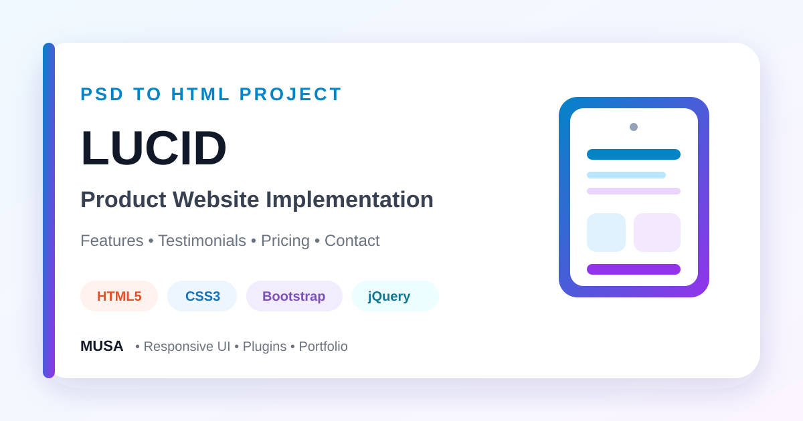

<div align="center">



# Lucid — PSD to HTML Product Website

### A responsive PSD-to-HTML implementation with Bootstrap, custom CSS, jQuery, Owl Carousel, Font Awesome, and reusable marketing sections.


[](https://github.com/samusa099)
[](https://developer.mozilla.org/docs/Web/HTML)
[](https://developer.mozilla.org/docs/Web/CSS)
[](https://getbootstrap.com/)
[](https://developer.mozilla.org/docs/Web/JavaScript)

[](https://github.com/samusa099/Asssignment_10.1)
[](https://github.com/samusa099/Asssignment_10.1)
[](https://github.com/samusa099/Asssignment_10.1/commits/main)

</div>

---

## 📌 Overview

A complete product landing-page exercise featuring a responsive hero, feature sections, device presentation, testimonials, pricing cards, calls to action, and contact content.

## 📚 Documentation

| Resource | Description |
|---|---|
| [**HOW_TO_USE.md**](HOW_TO_USE.md) | Detailed explanation of why, where, and how to study, customise, extend, and publish the project |
| [**Repository Cover**](assets/repository-cover.svg) | Scalable professional cover used in this README |

## ✨ Key Features

- Responsive product hero and navigation
- Feature and device showcase sections
- Owl Carousel testimonials
- Pricing-plan presentation
- Contact form and map section
- Custom responsive stylesheet

## 🗂️ Repository Structure

```text
Asssignment_10.1/
├── index.html
├── css/
├── js/
├── images/
├── assets/
│   └── repository-cover.svg
├── HOW_TO_USE.md
└── README.md
```

## 🚀 Run Locally

```bash
git clone https://github.com/samusa099/Asssignment_10.1.git
cd Asssignment_10.1
```

Open `index.html` in a browser or use **VS Code Live Server**.

> Contact, pricing, and download actions are static until connected to application services.

## 👤 Author

<div align="center">

### Musa

**Internationally certified HR professional and data analytics practitioner from Bangladesh.**  
Musa combines people operations, Excel, Power BI, SQL, and technology-driven problem-solving to build practical, structured, and user-focused projects.

[](https://github.com/samusa099)

</div>
